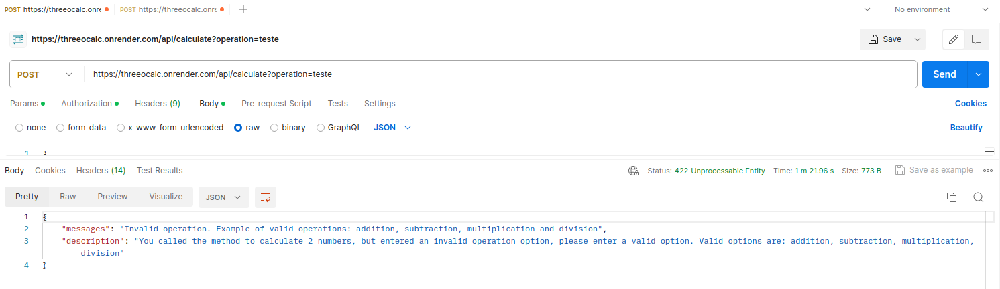
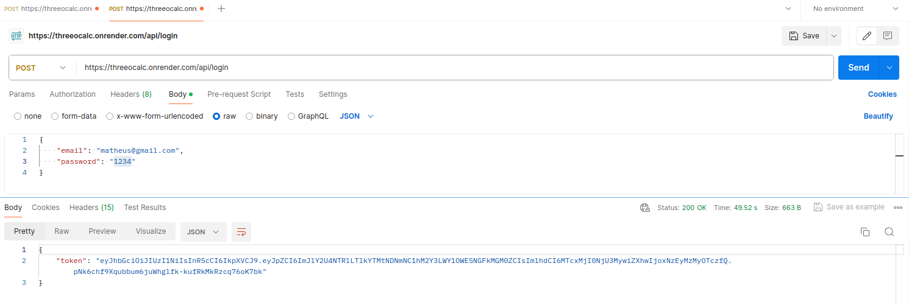

# Back-End

Bom, como informado no README.md raiz do projeto, cada submódulo tem um README.md próprio, onde eu aponto o resultado final de cada módulo de maneira separada.

Pelo Back-end, como já é possivel visualizar, utilizei ***NodeJS + TypeScript***, é obvio que isso é totalmente opcional, mas, se você estuda o mercado a um tempo, é possivel notar a evoluçã constante que essa biblioteca teve, acredito que o que tornava JavaScript o JavaScript era a capacidade de não ser tipada (fora outros pontos), porém, era muito nitido para todos que isso iria se tornar mais um fardo do que um sonho.

*Com TypeScript eu sinto que consigo ter o código mais na ponta dos meus dedos* - talvez pq eu seja, originalmente, programador Java - sinto que o programador, quando uso TypeScript, está sabendo 100% do que se passa por toda classe/método/interface/requisição e etc.

Olhando o meu *index.ts* ou o *Routes.route.ts* é possivel notar (assim como falado no README.md principal) que utilizei **Express** para lidar com as rotas da minha aplicação, e pq utilizei tal biblioteca? Pelo simples fato de costume, sim, eu poderia ter utilizado o **fastify**, por exemplo, que é uma biblioteca muito conhecida, porém, o **Express** é tão bom quanto, e para o contexto desse teste técnico se apresentava como uma solução muito, mas muito, viável.

### 📍 Rotas

Dentro dessa aplicação existe 2 principais rotas, e elas são:

```POST - /api/login```
```POST - /api/calculate?operation={ operation }```

### 🕵️ Ressalvas

###### POST - /api/calculate?operation=[operation]

Essa rota, como o nome já diz calcula uma operação, ela espera receber como body:

~~~ javascript
export interface CalculationRequestBodyDTO {
  firstNumber: number
  secondNumber: number 
}
~~~

e espera receber uma operação, obviamente essas operações devem ser do tipo String e as únicas possiveis são:

```"addition", "subtraction", "multiply" e "division"```

caso você insira valores diferentes desse, o retorno será:



e para esse caso, eu utilizei a seguinte classe util para validação:

~~~ javascript
export class OperationValidation {
  validate = (param: string): void => {
    if(!["addition", "subtraction", "multiply", "division"].includes(param))
      throw new ThreeoCalcExceptions("Invalid operation. Example of valid operations: addition, subtraction, multiplication and division", "You called the method to calculate 2 numbers, but entered an invalid operation option, please enter a valid option. Valid options are: addition, subtraction, multiplication, division");
  }
}
~~~

Desse método, as ressalvas mais importantes para quem for testar é isso, você pode testar esse endpoint utilizando a seguinte url:

```POST - https://threeocalc.onrender.com/api/calculate?operation={ operation }```

> Obs.: ela é uma rota privada, então necessita de um token JWT para acesso. 


###### POST - /api/login

Essa rota, como o nome já diz realiza login do usuário, ela espera receber como body:

~~~ javascript
export interface UserRequestBodyDTO {
  email: string
  password: string
}
~~~

e, caso tudo de certo (o usuário informado exista e a senha seja a mesma) ele irá te retornar um token JWT, em resumo, ela funcionará exatamente como na imagem:



Como foi informado que não tinha a necessidade de criar um banco de dados/operações de CRUD para usuários, criei dados mockados, porém, a implementação é exatamente igual do que seria se eu tivesse usando um PrismaClient como ORM, segue a implementação:

~~~ javascript
export class AuthService {
  constructor(private readonly userService: UsersService){ }

  auth = async (body: UserRequestBodyDTO): Promise<string> => {
    const user: UserDTO = this.userService.findByEmail(body.email);
    const isValidPassword = await compare(body.password, user.password);
	
    continua até gerar o token...
  }
}
~~~

e os dados mockados:

~~~ javascript
export class UsersService {
  constructor(private readonly userRepository: UsersRepository){ }

  findByEmail = (email: string): UserDTO => {
    const user: UserDTO | undefined = this.userRepository.findAll().find(user => user.email === email);

    if (!user)
      throw new ThreeoCalcExceptions("You called the method to log in, however, your username and/or password is invalid!", "You called the method to log in, however, your username and/or password is invalid!");
	
    return user;
  }
}
~~~

Enfim, caso você queira testar esse back-end em sua máquina, ele está implementado no Render, e você pode acessar pela seguinte URL:

https://threeocalc.onrender.com

Url para teste: https://threeocalc.onrender.com/api/calculate?operation=multiply

Be happy!
