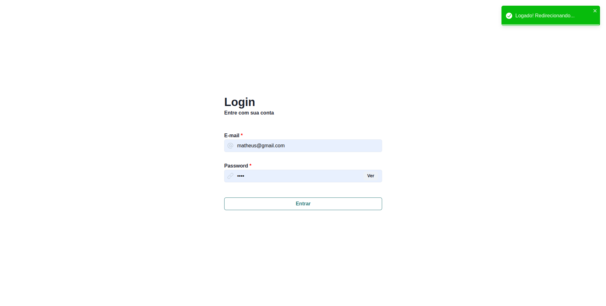

# Front-End

Bom, como informado no README.md raiz do projeto, cada submódulo tem um README.md próprio, onde eu aponto o resultado final de cada módulo de maneira separada.

Pelo Front-End, é possivel assistir um video do resultado final, então não vou explicar muito sobre.

O resultado final do teste pelo lado do Front-End é:

**Home Page:**

**Login Page**

**Error page**
Obs.: Essa tela só aparece quando rodamos o projeto localmente, o vercel buga essa pagina, então temos que sempre seguir o fluxo padrão do app (login > home).

### 🎥 Video

Veja como o site ficou visualizando o vídeo da minha execução, porém, você pode acessar o site usando essa url:

[ThreeoCalc - Vercel Deploy](https://threeo-calc-front-dumrgepgv-matheus-ferreira-santos-projects.vercel.app/)

> Obs.: É possivel encontrar o video dentro da pasta: *"example-video/ThreeoCalc-example.mp4"*
